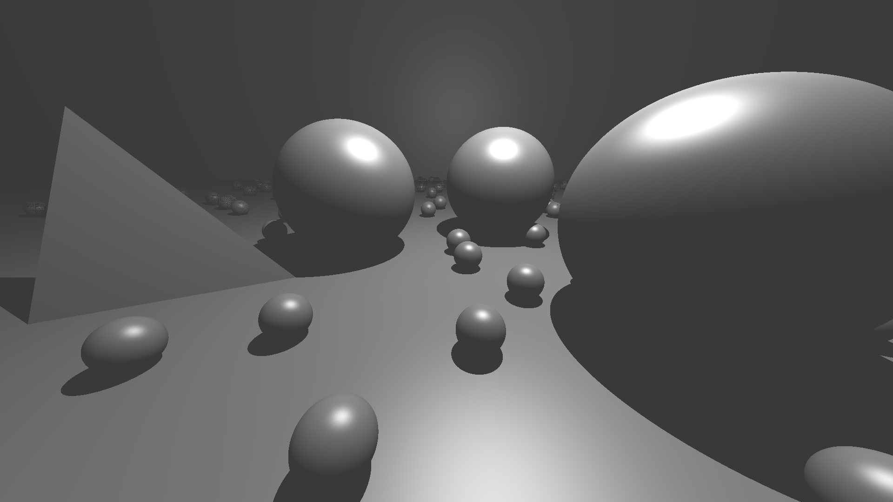
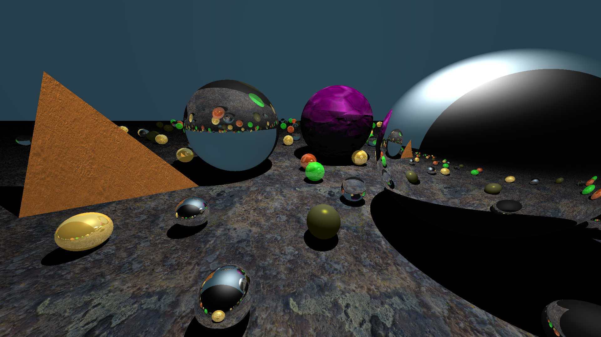
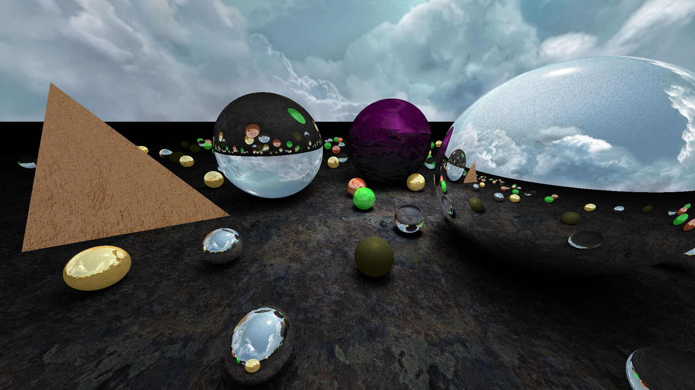
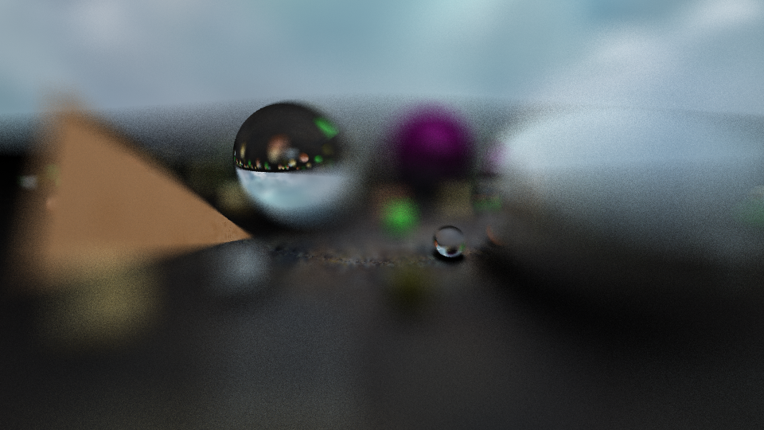

# CXX-Tracer

This is a small, educational project in C++ to get familiar with the language on a deeper level.

Used concepts:
- C++ (basics, object orientation specifics, templates, project setups, ...)
- OMP/SIMD
- CMake (setup, inclusion and generation of libraries, fetching, ...)
- (Doxygen, Docker, Sphinx, ...?)

## Implemented Features
This project implements a custom ray tracer providing many features, with a simple own maths/vector library.

### Objects

Implemented are planes, spheres and triangles. Easily extensible by just defining the appropriate intersection test and an objects axis-aligned bounding box per object.

### Textures & Mappings

Apart from reflexion and refraction, many texture types such as Diffuse, Normal, Ambient Occlusion are supported. Each texture can be mapped onto an object according to a mapping, similarly to OpenGL. Therefore CubeMaps, SphericalMaps, Equidistant Projections etc can be used for all objects. If rays hit nothing, the lighting value is read from an environment map instead.

### Soft Shadow Lighting

Dimensionless point lights generate unreal shadows with abprupt edges. More realistic light sources have dimensions and create gradual shadows. In this case, many shadow rays are shot instead of just one, averaging over generated outputs.

### Cameras & Sampling

For anti-aliasing, a simple implemented supersampling camera shoots multiple rays per pixel. One can generate different sampling patterns via sampling matrices (uniform, stochastic).

Apart from that, real cameras have imperfections such as non-infinite depth sharpness. In ray tracing, one can model a lense camera model and define a focus pane instead, the picture will then be created by randomly selecting multiple points (per pixel) on the lense that would also focus on the same pane point than the original ray (of that pixel):

  
  
  

### Acceleration Structures

Ray tracing is based on intersection tests of rays against object primitives. These tests are cheap, but the sheer amount of possible tests is the main cause for long runtimes.

Therefore, reducing the amount of intersection tests is crucial. Bounded volume hierarchies are a standard way for reducing the amount of intersection tests, and this method is implemented here. For further info see Wikipedia.

### Sample in Full Quality

## Future Work
- make transmission (in shadow rays) depth dependent instead of binary
- additional acceleration structure (kd-trees for instance)
- add trilinear filtering, anisotropic filtering and mip mapping
- add environment map filtering
- procedural textures, noise textures for cloud and mountain generation

## References
- Rock Textures (rock_\*.jpg) by BLACK LODGE GAMES, LLC, licensed under CC0.
- Crystal Textures (Crystal_\*.jpg) by Joao Paulo (Katsukagi, https://www.patreon.com/gendo) licensed under CC0
- Skybox Cube Texture (skybox_cube_texture.jpg) by Prof. Dr. Stefan Röttger (http://schorsch.efi.fh-nuernberg.de/roettger/index.php/Computergrafik/EnvironmentMapping) licensed under CC0-Attribution-NonCommercial
- Milky Way Texture (milky_way.jpg) by ESO licensed under CC Attribution 4.0 International (https://commons.wikimedia.org/wiki/File:ESO_-_Milky_Way.jpg)

## TODO
- add documentation generation via (xyz idk which stuff)
- maybe docker?
- cleanup rest of repo and publish
